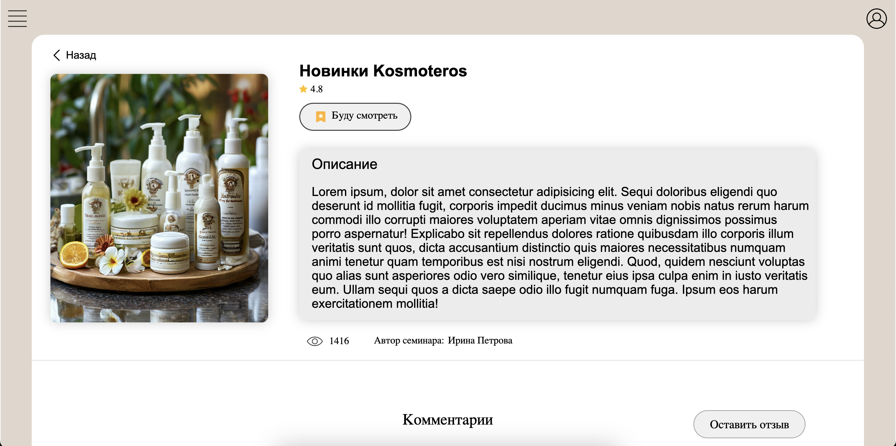
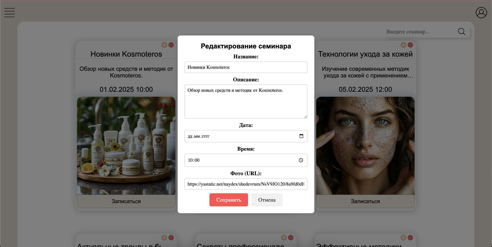
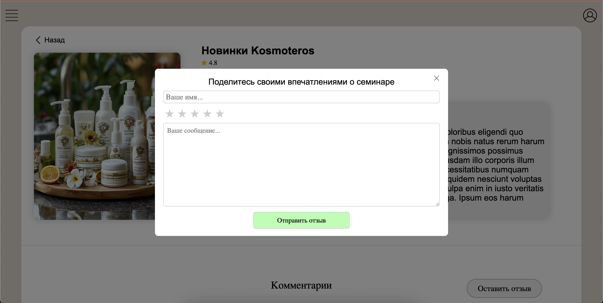
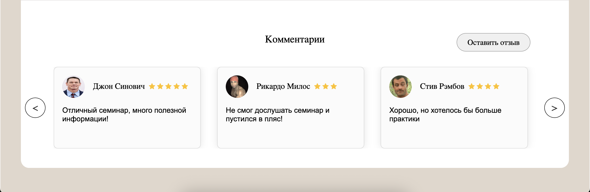

# Seminars 

Проект представляет собой платформу для просмотра семинаров.

## 🔨 Технологии / Стек  
- JavaScript / React / SCSS.  
- Node.js / Express / Bcrypt / JWT token.  
- MySQL.
- Docker.

## 🚀 Функционал

- Регистрация / Авторизация.
- Удаление / Редакторивание семинаров.
- Запись на семинары.
- Возможность оставлять комментарии к семинарам.

